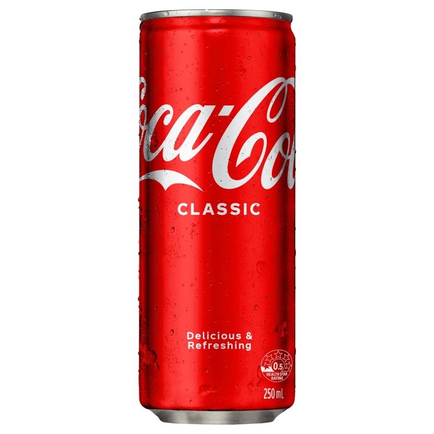
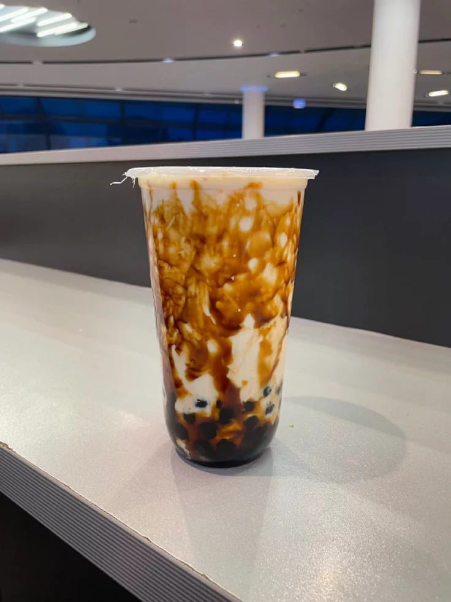
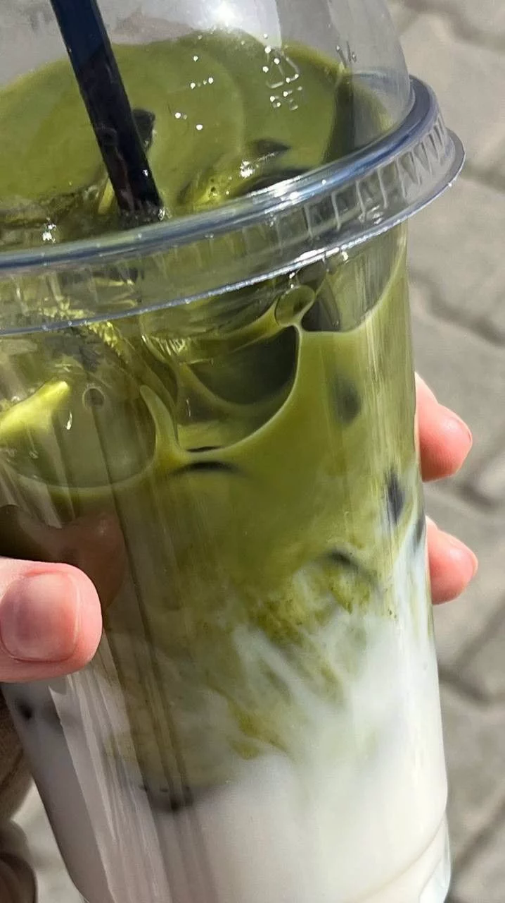

<!DOCTYPE html>  <html lang="id">  
<head>  
<meta charset="UTF-8">  
<meta name="viewport" content="width=device-width, initial-scale=1.0">  <title>NOVV CINEMA</title>  <link href="https://fonts.googleapis.com/css2?family=Poppins:wght@300;400;500;600;700;800&display=swap" rel="stylesheet">    </head>  <body>  <!-- LOGIN -->  
  <h2>LOGIN NOVV CINEMA</h2>  <input id="user" placeholder="Username">  <button onclick="enter()">  
Masuk  
</button>  
  <!-- NAVBAR -->  <nav>  
  
NOVV CINEMA  

  <button class="navbtn" onclick="openHistory()">  
History  
</button>  </nav>  <!-- MOVIES -->  
  
  
FILM ACTION  

  

  
  
FILM ROMANCE  

  

  
  
FILM HOROR  

  

  
  <!-- MODAL -->  
  
  <h2 id="movieName"></h2>  <iframe id="trailer"  
width="100%"  
height="220"  
style="  
border:none;  
border-radius:14px;  
margin-top:12px;  
margin-bottom:15px;  
"  
allowfullscreen>  
</iframe>  
  
LAYAR BIOSKOP  

  

  <h3 id="total">  
Total: Rp0  
</h3>  <h3 style="margin-top:10px;">  
🍿 NOVV DELICIOUS  
</h3>  
  
  

  
  
SALTED POPCORN  

   
  
Salty Goodness  

  
  
Rp37.000  

  
  <button class="snack-btn"  
onclick="addSnack(this,'Salted Popcorn',37000)">
PESAN
</button>

  
  

  
  
SWEET POPCORN  

  
  
Yummy  

  
  
Rp35.000  

  
  <button class="snack-btn"  
onclick="addSnack(this,'Sweet Popcorn',35000)">
PESAN
</button>

  
<!-- MINUMAN XXI -->  
  

  
  
COCA COLA 250ML  

  
  
Fresh Ice Drink  

  
  
Rp28.000  

  
  <button class="snack-btn"  
onclick="addSnack(this,'Coca Cola 250ML',28000)">
PESAN
</button>

  
  

  
  
BROWN SUGAR MILK  

  
  
Sweet & Smooth Drink  

  
  
Rp30.000  

  
  <button class="snack-btn"  
onclick="addSnack(this,'Brown Sugar Milk',30000)">
PESAN
</button>

  
  

  
  
MATCHA LATTE  

  
  
Premium NovvCinema Drink  

  
  
Rp37.000  

  
  <button class="snack-btn"  
onclick="addSnack(this,'Matcha Latte',37000)">
PESAN
</button>

  
  <button class="buybtn"  
style="background:#e50914;color:white;"  
onclick="buy()">
BELI SEKARANG
</button>

<button class="buybtn"  
style="background:#333;color:white;"  
onclick="closeModal()">

CLOSE

</button>  
  
  <!-- HISTORY -->  
  <h2>  
🎟 HISTORY TICKET  
</h2>  

  <button class="buybtn"  
style="background:#333;color:white;"  
onclick="closeHistory()">

CLOSE

</button>  

  
    </body>  
</html>
